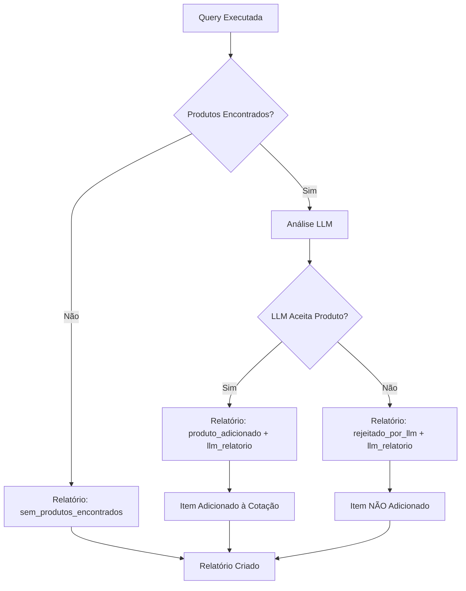

# 📊 Tabela Relatórios - Estrutura e Funcionamento

## 🎯 Visão Geral

A tabela `relatorios` é responsável por armazenar todas as análises e decisões tomadas durante o processamento de cotações, garantindo **rastreabilidade completa** e **auditoria detalhada** de cada busca realizada.

## 🏗️ Estrutura da Tabela

```sql
CREATE TABLE relatorios (
    id BIGSERIAL PRIMARY KEY,
    cotacao_id BIGINT REFERENCES cotacoes(id),
    analise_local JSONB,           -- 🎯 CAMPO PRINCIPAL
    criado_por TEXT,
    criado_em TIMESTAMP DEFAULT NOW(),
    atualizado_em TIMESTAMP DEFAULT NOW()
);
```

### 📝 Campo Principal: `analise_local`

O campo `analise_local` é um array JSONB que contém todas as análises realizadas para uma cotação. Cada entrada no array representa a análise de uma query específica.

## 🔍 Estrutura do JSON `analise_local`

### ✅ **Produto Encontrado e Aceito pela LLM**

```json
{
    "query_id": "Q1",
    "score": 0.856,
    "alternativa": false,
    "status": "produto_adicionado",
    "llm_relatorio": {
        "top_ranking": [
            {
                "id": 42,
                "nome": "Notebook Dell Inspiron 15",
                "preco": "850000.0",
                "posicao": 1,
                "justificativa": "Excelente custo-benefício para uso corporativo",
                "pontos_fortes": [
                    "Processador Intel i7",
                    "16GB RAM",
                    "SSD 512GB",
                    "Tela Full HD"
                ],
                "pontos_fracos": [
                    "Placa de vídeo integrada"
                ],
                "score_estimado": 0.92
            }
        ],
        "escolha_principal": "Notebook Dell Inspiron 15 (ID: 42)",
        "justificativa_escolha": "Produto atende perfeitamente aos requisitos de performance e orçamento",
        "criterios_aplicados": [
            "custo_beneficio: medio",
            "categoria: notebooks",
            "uso: corporativo"
        ],
        "observacoes": "Produto recomendado para ambiente de trabalho"
    }
}
```

### ❌ **Produtos Encontrados mas Rejeitados pela LLM**

```json
{
    "query_id": "Q2",
    "score": 0,
    "alternativa": false,
    "status": "rejeitado_por_llm",
    "observacao": "Produtos encontrados mas rejeitados pela análise LLM",
    "llm_relatorio": {
        "top_ranking": [
            {
                "id": 187,
                "nome": "HP Laserjet Pro MFP4104dw",
                "preco": "5030000.0",
                "posicao": 1,
                "justificativa": "Produto muito caro para o orçamento solicitado",
                "pontos_fortes": [
                    "Qualidade de impressão superior",
                    "Multifuncional completa"
                ],
                "pontos_fracos": [
                    "Preço muito elevado",
                    "Excede orçamento em 400%"
                ],
                "score_estimado": 0.3
            }
        ],
        "escolha_principal": "Nenhum deles foi escolhido", // 🎯 DECISÃO DE REJEIÇÃO
        "justificativa_escolha": "Todos os produtos excedem significativamente o orçamento disponível",
        "criterios_aplicados": [
            "custo_beneficio: baixo",
            "orcamento_maximo: 1500000"
        ],
        "observacoes": "Necessário buscar alternativas mais econômicas"
    }
}
```

### 🚫 **Nenhum Produto Encontrado**

```json
{
    "query_id": "Q3",
    "score": 0,
    "alternativa": false,
    "status": "sem_produtos_encontrados",
    "observacao": "Nenhum produto encontrado na base de dados"
}
```

### ⚠️ **Produto com Problemas**

```json
{
    "query_id": "Q4",
    "score": 0,
    "alternativa": false,
    "status": "produto_sem_id",
    "observacao": "Produto 'MacBook Pro M3' sem ID válido"
}
```

```json
{
    "query_id": "Q5",
    "score": 0.654,
    "alternativa": false,
    "status": "produto_duplicado",
    "observacao": "Produto 'iPhone 15' já existe na cotação"
}
```

## 🔄 Fluxo de Criação de Relatórios

### 1. **Processamento de Query**



### 2. **Garantia de Relatório**

🎯 **IMPORTANTE**: Um relatório é **SEMPRE** criado, independente do resultado:

- ✅ **Produto aceito**: Relatório + Item na cotação
- ❌ **Produto rejeitado**: Relatório preservado + Sem item na cotação  
- 🚫 **Nenhum produto**: Relatório de análise vazia
- ⚠️ **Problemas**: Relatório com detalhes do erro

## 📈 Benefícios da Nova Estrutura

### 🔍 **Rastreabilidade Completa**
- Todas as decisões ficam registradas
- Histórico de por que produtos foram rejeitados
- Análise detalhada de cada query

### 🧠 **Preservação da Análise LLM**
- Relatórios LLM são mantidos mesmo em rejeições
- `top_ranking` com justificativas detalhadas
- `pontos_fortes` e `pontos_fracos` de cada produto
- `criterios_aplicados` para auditoria

### 📊 **Métricas e Analytics**
```sql
-- Quantas queries tiveram produtos rejeitados pela LLM
SELECT COUNT(*) FROM relatorios 
WHERE analise_local @> '[{"status": "rejeitado_por_llm"}]';

-- Principais motivos de rejeição
SELECT 
    analise_local -> 0 -> 'llm_relatorio' -> 'justificativa_escolha' as motivo_rejeicao,
    COUNT(*) as quantidade
FROM relatorios 
WHERE analise_local @> '[{"status": "rejeitado_por_llm"}]'
GROUP BY motivo_rejeicao;

-- Produtos mais rejeitados
SELECT 
    jsonb_array_elements(analise_local -> 0 -> 'llm_relatorio' -> 'top_ranking') -> 'nome' as produto,
    COUNT(*) as rejeicoes
FROM relatorios 
WHERE analise_local @> '[{"status": "rejeitado_por_llm"}]'
GROUP BY produto
ORDER BY rejeicoes DESC;
```

## 🔧 Implementação Técnica

### **Inserção de Relatório**

```python
# Em cotacao_manager.py
def insert_relatorio(self, cotacao_id, analise_local, criado_por=None):
    payload = {
        "cotacao_id": cotacao_id,
        "analise_local": analise_local,
        "criado_por": criado_por
    }
    # Inserção via Supabase API
```

### **Processamento em app.py**

```python
# Produto aceito pela LLM
if produto.get("llm_relatorio"):
    payload = {
        "query_id": qid,
        "score": produto.get("score"),
        "alternativa": False,
        "llm_relatorio": produto.get("llm_relatorio")  # 🎯 Preserva análise
    }
    cotacao_manager.insert_relatorio(cotacao_id, [payload], criado_por)

# Produto rejeitado pela LLM
if produto.get("llm_rejected"):
    payload = {
        "query_id": qid,
        "score": 0,
        "alternativa": False,
        "status": "rejeitado_por_llm",
        "llm_relatorio": produto.get("llm_relatorio")  # 🎯 Preserva análise
    }
    cotacao_manager.insert_relatorio(cotacao_id, [payload], criado_por)
```

## 📋 Status Possíveis

| Status | Descrição | Item na Cotação | LLM Relatório |
|--------|-----------|----------------|---------------|
| `produto_adicionado` | Produto aceito e adicionado | ✅ Sim | ✅ Sim |
| `rejeitado_por_llm` | Produto rejeitado pela LLM | ❌ Não | ✅ Sim |
| `sem_produtos_encontrados` | Nenhum produto na busca | ❌ Não | ❌ Não |
| `produto_sem_id` | Produto sem ID válido | ❌ Não | ❌ Não |
| `produto_duplicado` | Produto já existe na cotação | ❌ Não | ❌ Não |

## 🎯 Casos de Uso

### **1. Debugging de Busca**
```sql
-- Ver por que uma query específica não retornou resultados
SELECT analise_local 
FROM relatorios 
WHERE analise_local @> '[{"query_id": "Q1"}]';
```

### **2. Análise de Performance LLM**
```sql
-- Taxa de aceitação da LLM por cotação
SELECT 
    cotacao_id,
    SUM(CASE WHEN analise_local -> 0 ->> 'status' = 'produto_adicionado' THEN 1 ELSE 0 END) as aceitos,
    SUM(CASE WHEN analise_local -> 0 ->> 'status' = 'rejeitado_por_llm' THEN 1 ELSE 0 END) as rejeitados
FROM relatorios 
GROUP BY cotacao_id;
```

### **3. Auditoria de Decisões**
```sql
-- Relatórios completos com justificativas de rejeição
SELECT 
    cotacao_id,
    analise_local -> 0 -> 'llm_relatorio' -> 'escolha_principal' as decisao_llm,
    analise_local -> 0 -> 'llm_relatorio' -> 'justificativa_escolha' as justificativa
FROM relatorios 
WHERE analise_local @> '[{"status": "rejeitado_por_llm"}]';
```

## 🚀 Evolução Futura

### **Métricas Avançadas**
- Dashboard de performance LLM
- Análise de padrões de rejeição
- Otimização de critérios de busca

### **Machine Learning**
- Treinamento baseado em decisões LLM
- Predição de aceitação de produtos
- Melhoria contínua dos algoritmos

---

## 📞 Suporte

Para dúvidas sobre a estrutura de relatórios ou implementação de novas funcionalidades, consulte:

- **Documentação da API**: `CONSUMO_API_BUSCA_LOCAL.md`
- **Migração de Schema**: Scripts SQL de migração
- **Exemplos de Uso**: Casos práticos neste documento

---

*Documentação atualizada em: 3 de setembro de 2025*  
*Versão: 2.0 - Nova estrutura com preservação LLM*
